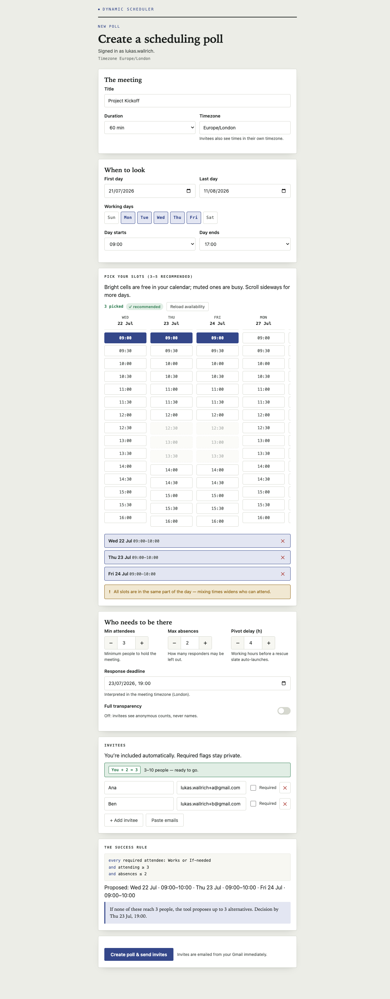
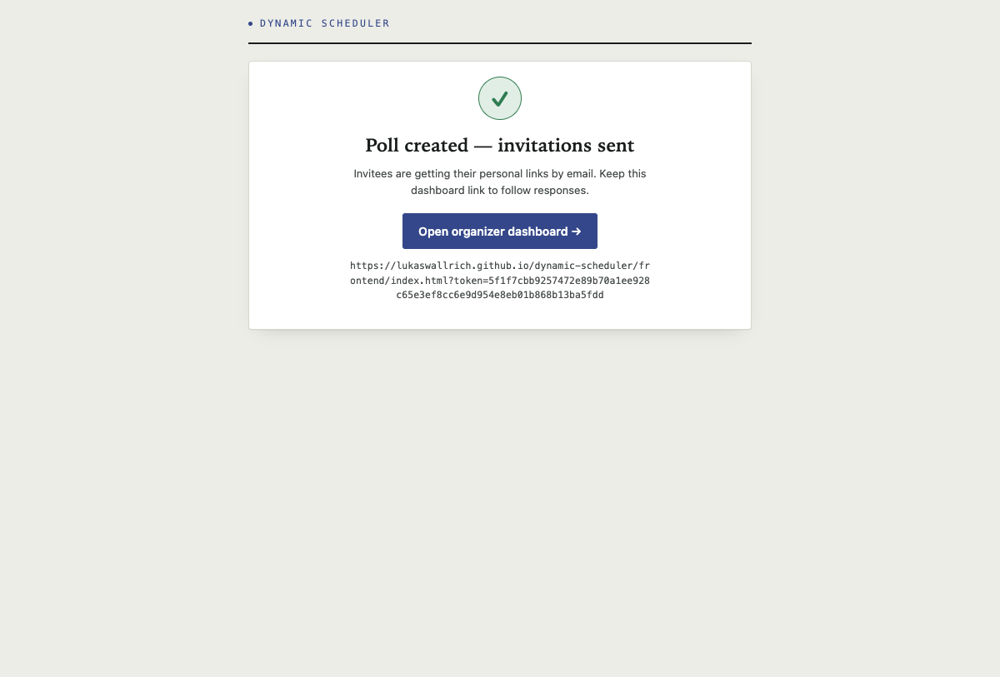
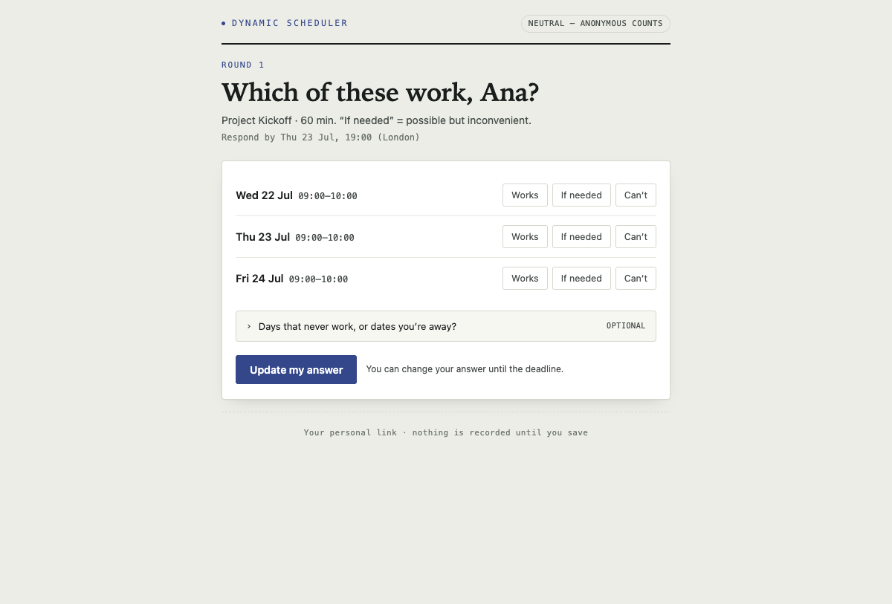
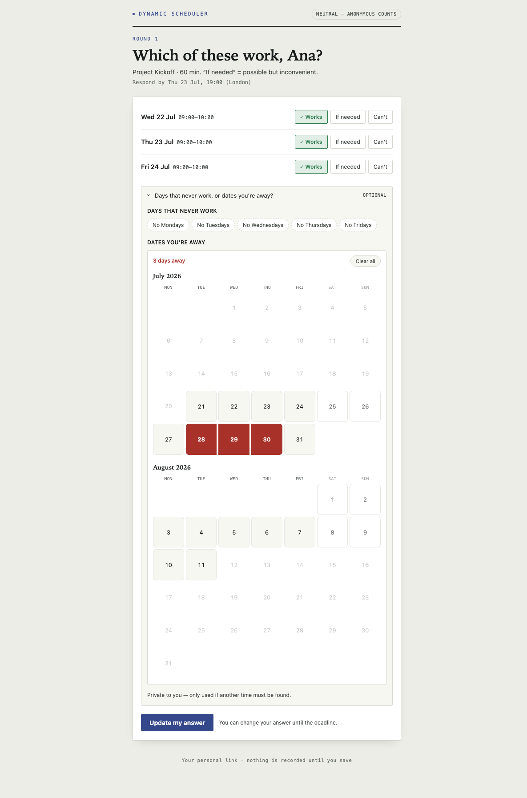
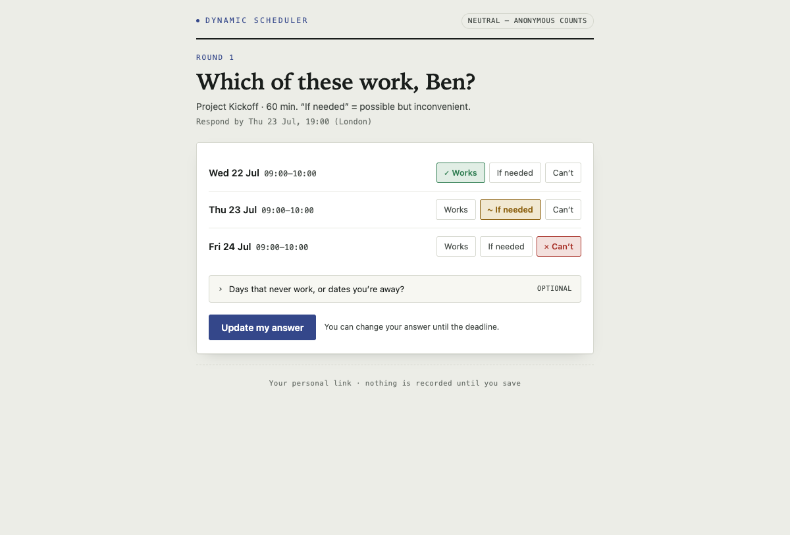
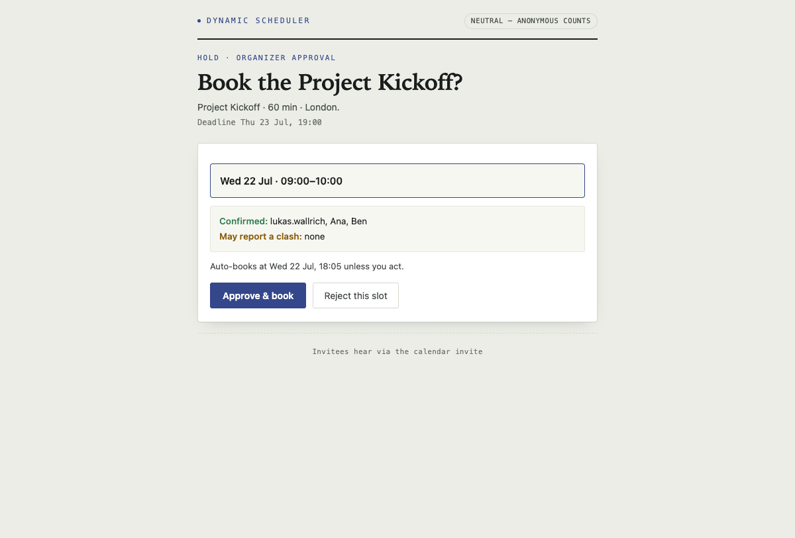
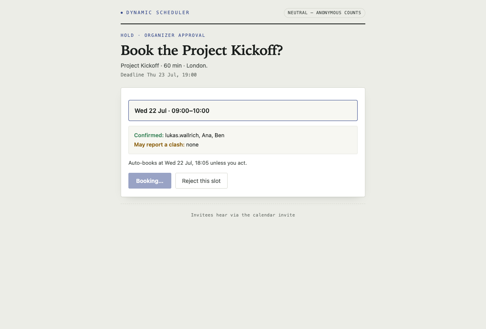

# Dynamic Group Scheduler

A lightweight Doodle/Calendly alternative for 3–10 person meetings, running entirely on
the organizer's own Google account (Apps Script + Sheets + Gmail + Calendar). The
organizer proposes 2–8 slots from their real free/busy; invitees answer via personal
tokenized links with no login; the system detects when a slate is provably dead and
pivots once to a computed rescue slate before asking anyone again. When a slot wins, the
organizer approves and a real calendar invite goes out.

**Live frontend:** https://lukaswallrich.github.io/dynamic-scheduler/frontend/
(static, no build step — host it anywhere; the backend is a Google Apps Script JSON API).

## How it works

1. **Setup** — the organizer picks slots on an aligned time grid built from their real
   calendar availability, sets the success rule (min attendees, max absences, deadline),
   and lists invitees. Invites are emailed immediately.
2. **Round 1** — each invitee marks Works / If needed / Can't per slot, and can
   optionally add avoid-rules: weekdays that never work, plus a paint-over calendar for
   dates they're away. Answers are revisable until the deadline.
3. **Early decision** — as soon as one slot provably beats every rival (or the deadline
   tiebreaks), the poll moves to **HOLD**: the organizer gets an approval email naming
   who is covered. No reply auto-books in 24 h.
4. **Pivot (only from failure)** — if the whole slate dies, the system computes a rescue
   slate from what people reported (votes, avoid-rules, organizer free/busy). The
   organizer votes first, then round 2 goes out. Two slates is a hard cap; after that it
   escalates to explicit organizer choices instead of polling forever.
5. **Booked** — on approval a Google Calendar event is created for everyone; invitees
   hear via the calendar invite.

Visibility is **neutral** by default: invitees see anonymous counts only, never names or
who is required. Organizer diagnostics do name people.

## Walkthrough (real run)

The screenshots below are from a live end-to-end run: poll created on the hosted
frontend, invites delivered by Gmail, two invitees voting, early decision, HOLD approval
and a real calendar event.

**1 · Organizer creates the poll** — aligned availability grid, success rule, invitees:

**2 · Invites go out immediately**, with the dashboard link for the organizer:

**3 · An invitee's personal page** — three answers per slot, nothing recorded until saved:

**4 · Optional avoid-rules** — weekday toggles plus a drag-to-paint absence calendar:

**5 · Mixed answers** are fine — If needed satisfies the rule but ranks below Works:

**6 · Early decision → HOLD** — the organizer sees who is covered and approves:

**7 · Booked** — a real calendar event with all attendees; the poll closes:

## Architecture

- **`core/`** — pure decision logic (`Sched.*`): votes, constraints, engine (state
  machine + success rule), pivot scoring, candidate universe, email/page text. No
  platform APIs, all time injected. Runs identically under Node (tests), Apps Script,
  and the browser (live feasibility preview).
- **`gas/`** — the Apps Script shell: JSON HTTP dispatcher (`web.js`), view-model
  builder (`api.js`), the single locked writer (`advance.js`), Sheets storage
  (`store.js`), calendar, mail, cron, tokens. It loads a snapshot, calls the core,
  persists what the core returns, and executes the side effects the core requested.
- **`frontend/`** — a standalone static app (vanilla JS, no build). Talks to the backend
  with CORS *simple requests* only (POST + `text/plain` JSON — Apps Script cannot answer
  preflights). Host it anywhere; set `API_BASE` in `frontend/api.js`.

Contracts: **DESIGN.md** (behavior), **ARCHITECTURE.md** (module seams), **API.md**
(HTTP/JSON). One Apps Script quirk worth knowing: all deployed files share a single
global scope, so top-level names must be unique across `core/` + `gas/` —
`test/globals.test.mjs` enforces this.

## Deploy your own

The deployer **is** the organizer: the web app executes as the deploying account, so
free/busy, sent mail, and the final booking all use that account. One instance per
organizer.

1. `npm install -g @google/clasp && clasp login`
2. `clasp create --type webapp --title "Group Scheduler"` (or `clasp clone <scriptId>`),
   then `clasp push`.
3. In the Apps Script editor: **Deploy → New deployment → Web app**, execute as *me*,
   access *Anyone*. Authorize the scopes (Sheets, Calendar, Gmail, triggers).
4. Run `installTrigger` once from the editor (hourly cron: reminders, deadlines,
   auto-book).
5. Host the frontend: publish this repo to GitHub Pages (or copy `frontend/` + `core/`
   to any static host) and set `API_BASE` in `frontend/api.js` to your `/exec` URL.
6. Open `<frontend-url>?setup=<SETUP_TOKEN>` to create your first poll. The token is
   minted on first use into Script Properties (`SETUP_TOKEN`) — print it with
   `getSetupUrl()` in the editor. Keep it private; it authorizes poll creation on your
   account.

## Where data lives

A Google Sheet named `DynamicScheduler-Store` (auto-created; id kept in Script
Properties) holds all tables: polls, invitees, slots, votes, constraints, outbox, audit.
Only SHA-256 token hashes are stored there; raw invitee tokens live in Script Properties
and are deleted when a poll ends. All mail is sent from the organizer's own Gmail, with
a daily budget that suppresses lowest-priority mail first.

## Tests

`npm test` — 53 Node tests: unit tests per core module, an HTTP contract test, a full
journey replay (slate dies → bench → pivot → round 2 → HOLD → booked), and the
global-scope collision check.
